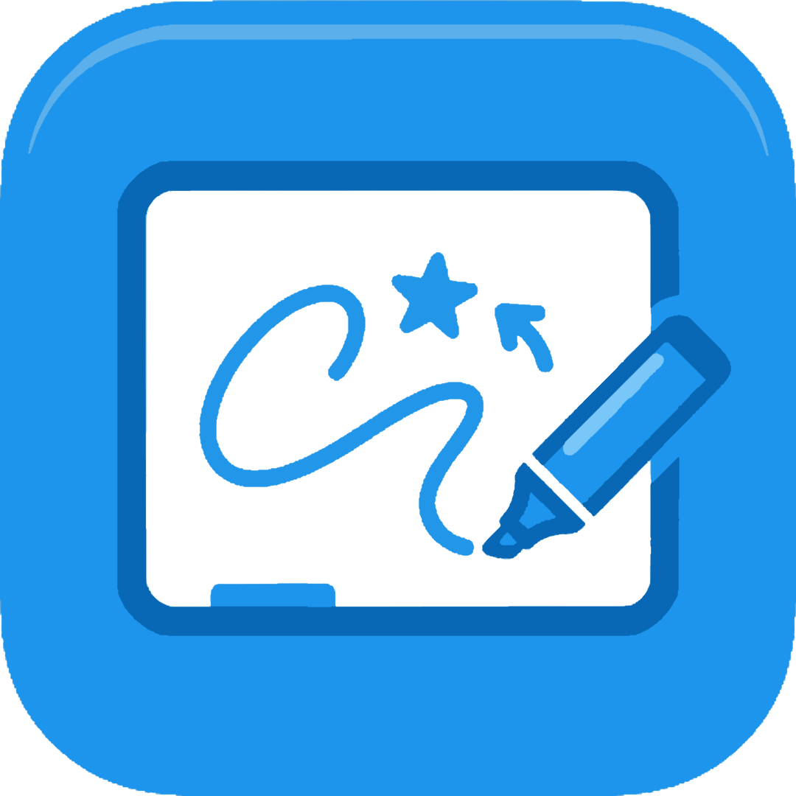
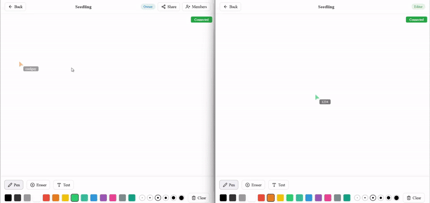
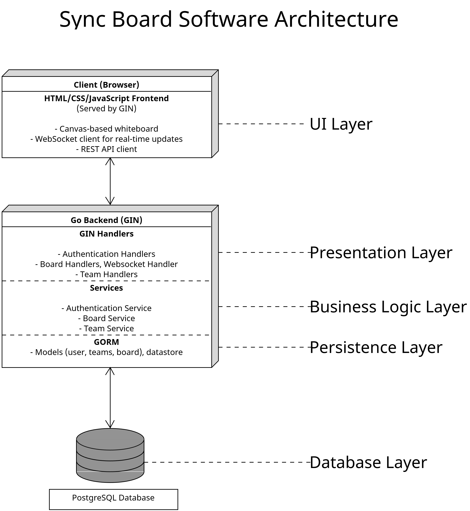
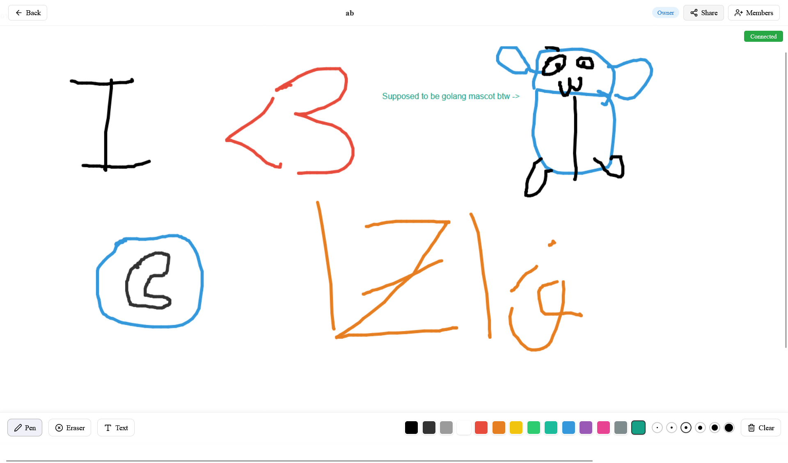
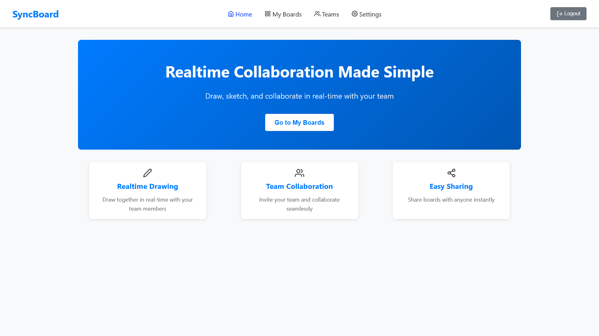
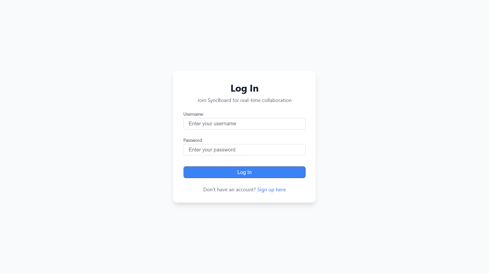
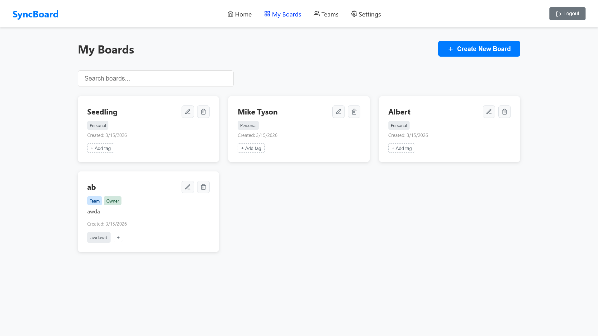
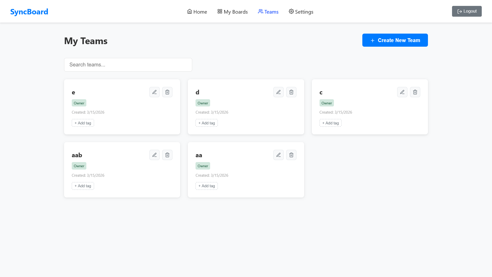
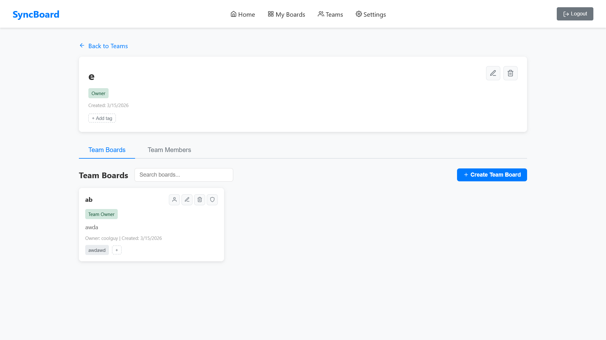

# Sync Board - Real-Time Collaborative Whiteboard

Sync Board is a real-time collaborative whiteboard application designed for organizational teams. It enables multiple users to create, draw, and share ideas on shared boards with customizable colors and text annotations. The system supports 1000+ concurrent users with sub-500ms latency, making it suitable for large team brainstorming sessions.

## First Look



## Why Sync Board?

Brainstorming and idea sharing across large teams is often fragmented across multiple tools, suffers from latency issues, and lacks robust, permissioned collaboration on a single canvas. Sync Board provides:

- Real-time collaboration with minimal latency
- Role-based access control for secure team collaboration
- Board creation, sharing, and permission management
- Freehand drawing with color customization and text annotations

## Target Users

- **Teams and Organizations**: Companies needing collaborative ideation tools
- **Team Managers**: Users who manage their team and board lifecycle
- **Board Owners**: Users who own and manage specific boards
- **Editors**: Team members who contribute content to team boards
- **Viewers**: Observers who can only view board contents

---

## System Architecture Overview



### Architecture Style

The system follows a **Layered Architecture** with clear separation:

1. **UI Layer**: HTML/CSS/JavaScript served by the Go backend
2. **Presentation Layer**: REST API and Websocket handlers using GIN framework
3. **Business Logic Layer**: Services for authentication, boards, and teams
4. **Persistence Layer**: GORM ORM for database operations
5. **Database Layer**: PostgreSQL

---

## User Roles & Permissions

### Role Hierarchy

| Role             | Description                                                                                           |
| ---------------- | ----------------------------------------------------------------------------------------------------- |
| **Team Manager** | Creates teams, manages members, assigns roles, controls team boards, restrict board owner permissions |
| **Board Owner**  | Owns a board, manages access permissions, can grant Editor/Viewer roles                               |
| **Editor**       | Can draw, annotate, and edit text on boards they have access to                                       |
| **Viewer**       | Can only view board contents, cannot modify anything                                                  |

### Permission Matrix

| Action              | Team Manager | Board Owner | Editor | Viewer |
| ------------------- | ------------ | ----------- | ------ | ------ |
| Create Board        | ✓            | ✓           | ✗      | ✗      |
| Delete Board        | ✓            | ✓\*         | ✗      | ✗      |
| Edit Board Metadata | ✓            | ✓\*         | ✗      | ✗      |
| Draw on Board       | ✓            | ✓\*         | ✓      | ✗      |
| Add/Remove Members  | ✓            | ✓\*         | ✗      | ✗      |
| View Board          | ✓            | ✓           | ✓      | ✓      |
| Add Team Member     | ✓            | ✗           | ✗      | ✗      |
| Edit Team Metadata  | ✓            | ✗           | ✗      | ✗      |

\*Only their personal board or given permission by team manager.

---

## Technology Stack

| Component            | Technology                       |
| -------------------- | -------------------------------- |
| **Backend**          | Go 1.25 (Golang)                 |
| **Web Framework**    | GIN                              |
| **Database**         | PostgreSQL 16                    |
| **ORM**              | GORM                             |
| **Real-time**        | WebSocket (gorilla/websocket)    |
| **Authentication**   | Token-based (BLAKE2b + Argon2id) |
| **Canvas Rendering** | canvas library (tfriedel6)       |
| **Image Format**     | WebP                             |
| **Frontend**         | Plain HTML/CSS/JavaScript        |
| **Deployment**       | Docker, Docker Compose           |

---

## Installation & Setup

### Prerequisites

- Docker and Docker Compose
- Go 1.25+ (for local development)
- PostgreSQL 16+ (for local development)

### Run the Sync Board Quick Start with Docker

1. Clone the repository:

```bash
git clone <repository-url>
cd sync-board
```

2. Set up environment

```bash
cp sample.env .env
nvim .env # Edit as needed
```

3. Start the application:

```bash
docker-compose up --build
```

4. Access the application at `http://localhost:8000`

### Local Development Setup

1. Install dependencies:

```bash
go mod download
```

2. Create `.env` file:

```bash
cp sample.env .env
# Edit .env with your settings
```

3. Run the application:

```bash
go run .
```

---

## API Endpoints

### Authentication

- `POST /api/signup` - Create new user
- `POST /api/login` - User login
- `POST /api/logout` - User logout
- `GET /api/users/search` - Search users

### Boards

- `POST /api/boards` - Create board
- `GET /api/boards` - List user boards
- `GET /api/boards/:id` - Get board details
- `PATCH /api/boards/:id` - Update board
- `DELETE /api/boards/:id` - Delete board
- `GET /api/boards/:id/members` - Get board members
- `POST /api/boards/:id/members` - Add member
- `DELETE /api/boards/:id/members/:userId` - Remove member

### Teams

- `POST /api/teams` - Create team
- `GET /api/teams` - List user teams
- `GET /api/teams/:id` - Get team details
- `PATCH /api/teams/:id` - Update team
- `DELETE /api/teams/:id` - Delete team
- `GET /api/teams/:id/boards` - Get team boards

### WebSocket

- `GET /api/sync-board?board_id=<id>` - Real-time board connection

---

## Screenshots

### Whiteboard




### Home Page



### Login Page



### My Boards



### Teams Page



### Team Page

